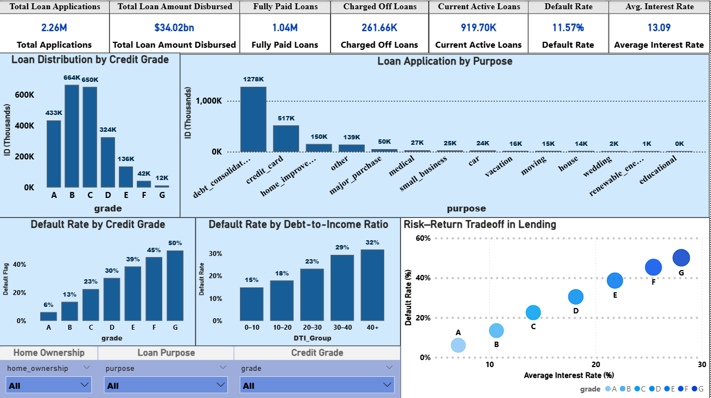
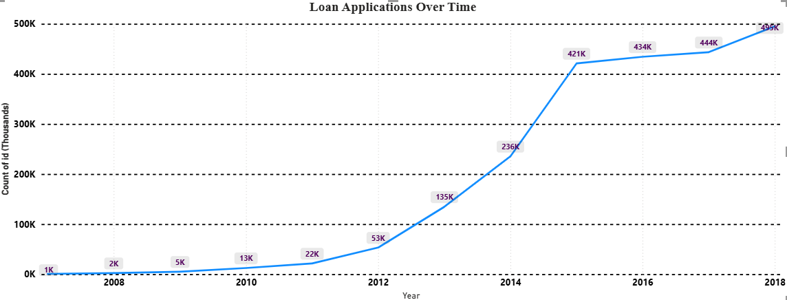

# LendingClub Credit Risk & Portfolio Analytics

## Project Overview

This project analyzes the **LendingClub public loan dataset** to understand the drivers of credit risk and lending portfolio performance in peer-to-peer lending.

The analysis focuses on identifying patterns in borrower characteristics, loan attributes, and financial indicators that influence **loan default probability** and **portfolio risk exposure**.

The project combines **Python-based exploratory data analysis, SQL queries, and a Power BI dashboard** to generate actionable business insights for lending decision-making.


# Business Problem

Lending platforms must balance **portfolio growth and profitability** with **credit risk management**.

Key analytical questions addressed in this project:

* What borrower characteristics influence loan default risk?
* Which credit grade segments represent the largest share of the lending portfolio?
* How does debt-to-income ratio impact loan repayment performance?
* How does interest rate pricing correspond to borrower risk levels?

Understanding these factors helps financial institutions improve **risk assessment, portfolio monitoring, and lending strategies**.


# Dataset

**Source:** LendingClub Public Loan Dataset
**Domain:** Peer-to-peer consumer lending
**Time Period:** 2007–2018

The dataset contains loan-level information including borrower financial metrics, credit grades, loan amounts, interest rates, and repayment outcomes.

Due to file size limitations (~1.1 GB), the full dataset is not included in this repository. A **50,000-row sample dataset** is provided for reproducibility.

Full dataset source:

[https://www.kaggle.com/datasets/wordsforthewise/lending-club](https://www.kaggle.com/datasets/wordsforthewise/lending-club)


# Methodology

The project follows a structured analytics workflow:

### 1. Data Preparation

* Dataset sampling for efficient analysis
* Feature engineering:

  * Default flag creation
  * Debt-to-Income (DTI) grouping

### 2. Exploratory Data Analysis (Python)

* Loan distribution across credit grades
* Default rate analysis
* Borrower financial behavior
* Risk driver identification

### 3. SQL-Based Analysis

Analytical queries were used to evaluate:

* Loan distribution by credit grade
* Default rate across borrower segments
* Loan application purpose distribution
* Average interest rate across credit grades

### 4. Business Intelligence Dashboard

An interactive **Power BI dashboard** was built to visualize:

* Portfolio KPIs
* Loan distribution by credit grade
* Borrower loan purpose patterns
* Default rate by risk indicators
* Risk-return tradeoffs in lending


# Key Insights

**Moderate Risk Borrowers Dominate the Portfolio**
Most loans belong to **Credit Grades B and C**, indicating LendingClub primarily serves moderate-risk borrowers.

**Debt Consolidation is the Leading Loan Purpose**
Debt consolidation accounts for the largest share of loan applications.

**Credit Grade Strongly Predicts Default Risk**
Default rates increase significantly from **Grade A borrowers to Grade G borrowers**.

**Debt-to-Income Ratio is a Key Risk Driver**
Borrowers with higher DTI ratios show a substantially higher probability of default.

**Risk-Based Pricing is Evident**
Interest rates increase with borrower risk levels, indicating a risk-adjusted pricing strategy.

**Rapid Platform Growth**
Loan applications increased significantly between **2007 and 2018**, reflecting the expansion of peer-to-peer lending.


# Dashboard

### Portfolio Analytics Dashboard



The dashboard summarizes portfolio performance and borrower risk characteristics through interactive visualizations.


### Loan Applications Over Time



This chart highlights the rapid growth of the LendingClub platform over time.

> Note: The Power BI `.pbix` file is excluded from the repository due to GitHub file size limitations. Dashboard insights are demonstrated through screenshots.


# Technologies Used

* Python
* Pandas
* Matplotlib
* Seaborn
* SQL
* Power BI
* DAX
* Jupyter Notebook


# Project Structure

```
lendingclub-credit-risk-analysis/

data/
    loan_sample.csv

scripts/
    create_sample.py

notebooks/
    eda.ipynb

sql/
    analysis.sql

images/
    dashboard_main.png
    loan_applications_over_time.png

README.md
requirements.txt
.gitignore
```


# How to Run the Project

### 1. Clone the repository

```bash
git clone https://github.com/thepanchanandgupta/lendingclub-credit-risk-analysis.git
```

### 2. Install dependencies

```bash
pip install -r requirements.txt
```

### 3. Run the analysis notebook

```bash
jupyter notebook notebooks/eda.ipynb
```

---

# Learning Outcomes

This project demonstrates:

* Financial data analysis
* Credit risk assessment
* Exploratory data analysis (EDA)
* SQL-based business analytics
* Business intelligence dashboard development
* Data-driven storytelling for financial decision making

---

# Author

**Panchanand Gupta**
PGDM Candidate — Business Analytics

---

If you want, I can also help you **write the resume bullet points for this project so it looks strong for analytics internship applications (especially for firms like Affine, Fractal, MuSigma, etc.)**.
